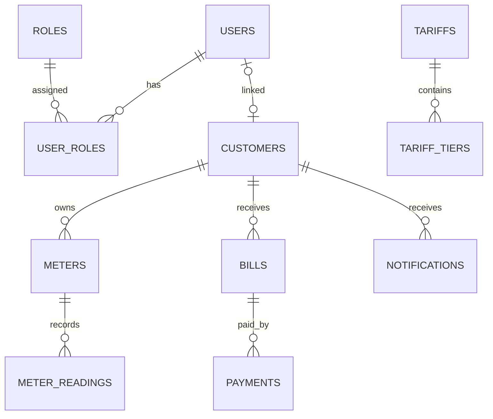
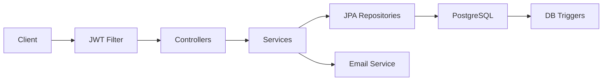

# Utility Billing System (WASAC / REG)

Spring Boot backend for water and electricity postpaid billing with JWT security.

## Run

```bash
./mvnw spring-boot:run
```

- Swagger UI: http://localhost:8080/swagger-ui.html
- Default admin: `admin@wasac.com` / `admin123`

Create PostgreSQL database `utility_billing` and update `application.properties` if needed.

## Main Workflow

```
Customer signs up (POST /api/auth/register)
        ↓
Customer logs in (POST /api/auth/login)
        ↓
Admin creates/assigns meter (POST /api/meters)
        ↓
Admin creates active tariff (POST /api/tariffs)
        ↓
Operator captures meter reading (POST /api/readings)
        ↓
System auto-generates bill (status PENDING)
        ↓
Finance/Admin approves bill (PUT /api/bills/{billId}/approve)
        ↓
Customer receives notification + email attempt
        ↓
Customer views bill (GET /api/bills/customer/{customerId})
        ↓
Customer pays bill (POST /api/payments)
        ↓
System updates balance/status (PARTIALLY_PAID / PAID)
        ↓
Customer views payment history (GET /api/payments/customer/{customerId})
```

## API Summary

### 1. Authentication

| Method | Endpoint | Access | Notes |
|--------|----------|--------|-------|
| POST | `/api/auth/register` | Public / Admin | Customers self-register (no role → `ROLE_CUSTOMER`). Admin registers staff with `ROLE_ADMIN`, `ROLE_OPERATOR`, or `ROLE_FINANCE` |
| POST | `/api/auth/login` | Public | Returns JWT — use `Authorization: Bearer <token>` |

Customer register body requires: `fullNames`, `email`, `phoneNumber`, `password`, `nationalId`, `address`.

### 2. Customers (Admin)

| Method | Endpoint |
|--------|----------|
| POST | `/api/customers` |
| GET | `/api/customers` |
| GET | `/api/customers/{id}` |
| PUT | `/api/customers/{id}` |
| DELETE | `/api/customers/{id}` |

Delete cascades: meters, readings, bills, payments, notifications.

### 3. Meters (Admin)

| Method | Endpoint |
|--------|----------|
| POST | `/api/meters` |
| GET | `/api/meters` |
| GET | `/api/meters/{id}` |
| GET | `/api/meters/customer/{customerId}` |

### 4. Tariffs (Admin)

| Method | Endpoint |
|--------|----------|
| POST | `/api/tariffs` |
| GET | `/api/tariffs` |
| GET | `/api/tariffs/active/{meterType}` |
| PUT | `/api/tariffs/{id}` |

Tariff fields: meter type, tariff type (`FLAT`/`TIERED`), rate per unit, fixed charge, VAT %, late penalty %.

### 5. Meter Readings (Operator)

| Method | Endpoint |
|--------|----------|
| POST | `/api/readings` |
| GET | `/api/readings` |
| GET | `/api/readings/meter/{meterId}` |

Capturing a reading auto-generates a bill. Consumption = current − previous.

### 6. Bills

| Method | Endpoint | Access |
|--------|----------|--------|
| POST | `/api/bills/generate/{readingId}` | Admin, Finance |
| PUT | `/api/bills/{billId}/approve` | Admin, Finance |
| GET | `/api/bills/customer/{customerId}` | Admin, Finance, Customer (own only) |
| GET | `/api/bills/{id}` | Admin, Finance, Customer (own only) |

Bill statuses: `PENDING`, `APPROVED`, `PARTIALLY_PAID`, `PAID`, `OVERDUE`.

### 7. Payments

| Method | Endpoint | Access |
|--------|----------|--------|
| POST | `/api/payments` | Admin, Finance, Customer |
| GET | `/api/payments` | Admin, Finance |
| GET | `/api/payments/customer/{customerId}` | Admin, Finance, Customer (own only) |
| GET | `/api/payments/bill/{billId}` | Admin, Finance, Customer (own only) |

### 8. Notifications

| Method | Endpoint | Access |
|--------|----------|--------|
| GET | `/api/notifications` | Admin |
| GET | `/api/notifications/customer/{customerId}` | Admin, Customer (own only) |
| PUT | `/api/notifications/{id}/read` | Admin, Customer |

## Business Rules

- Public users cannot register staff roles
- Inactive customers cannot receive bills
- One reading per meter per month/year; current > previous; meter must be active
- Versioned tariffs; new tariffs apply to future cycles only
- Penalty applied when approved bill is past due (on view or payment)
- Partial payments set `PARTIALLY_PAID`; full payment sets `PAID`
- Approval sends internal notification (DB trigger) and attempts email (logs failure if Gmail not configured)

## ERD



## Spring Boot Flow


